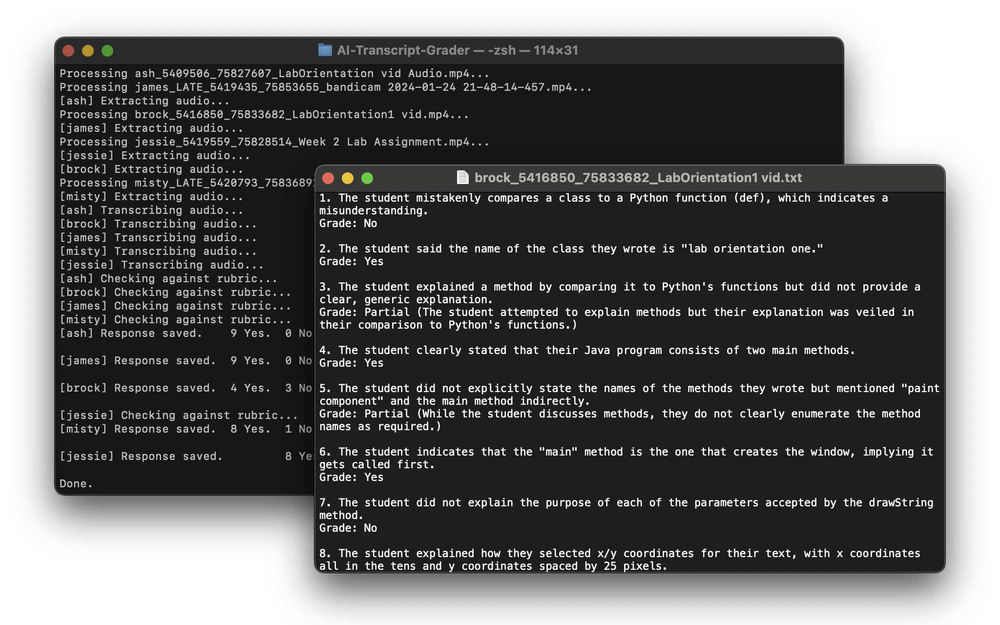

_**Notice:** This grader is not always 100% accurate. The AI will often find excuses to give a student a low score, or may not understand what the student said._

_**Always double-check the student's submission** if the AI's reasoning sounds off or a bad score is given._

# AI-Transcript-Grader
Uses OpenAI's Whisper and ChatGPT APIs to compare student video submissions against a given rubric.

## Setup
- Install required dependencies using `pip install -r requirements.txt`. 
- Add your OpenAI API Key to your environment variables

## Grading
- Download student video submissions into a single folder.
- Paste rubric into `rubric.txt` file (or include your rubric txt file as an argument).
  - If there are any rubric items that require visual feedback, leave those out of the txt file.
- Run `python main.py path/to/video/files [path/to/rubric]`

The AI will attempt to assign a score of `Yes`, `No`, or `Partial` for each rubric item, along with an explanation for why it gave that score. _It is recommended that you double-check the student's submission for any `No` or `Partial` scores given._

## Common errors
- If you get an error message about ffmpeg, you may need install ffmpeg with Homebrew using: `brew install ffmpeg`
